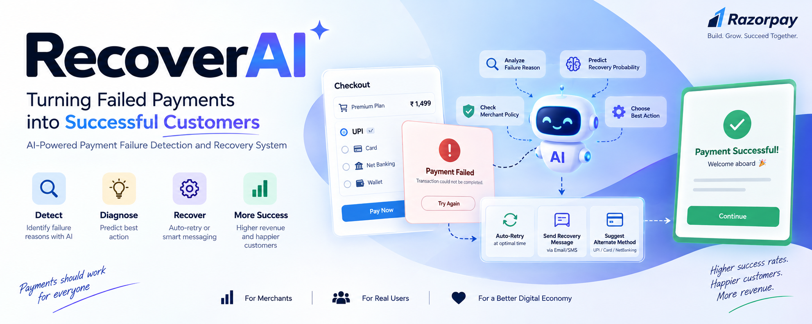
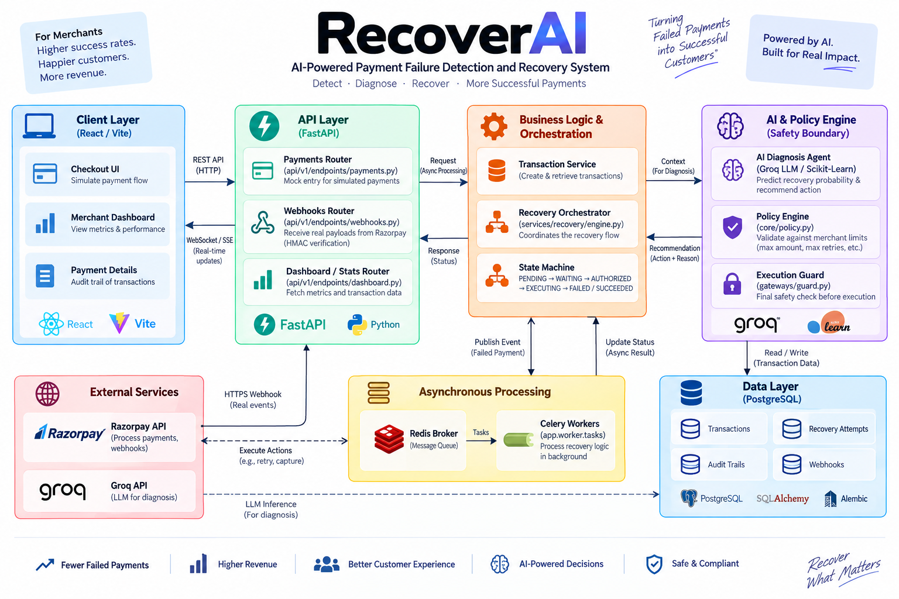
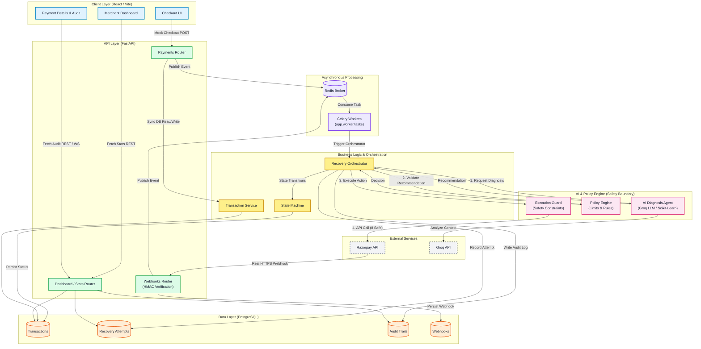
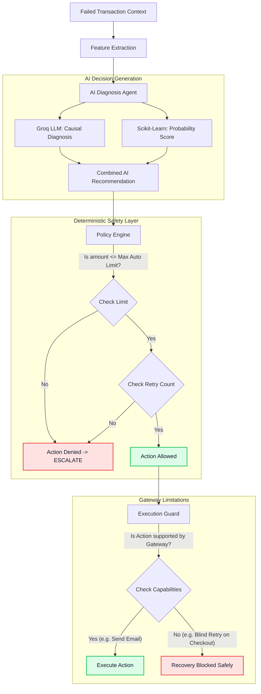
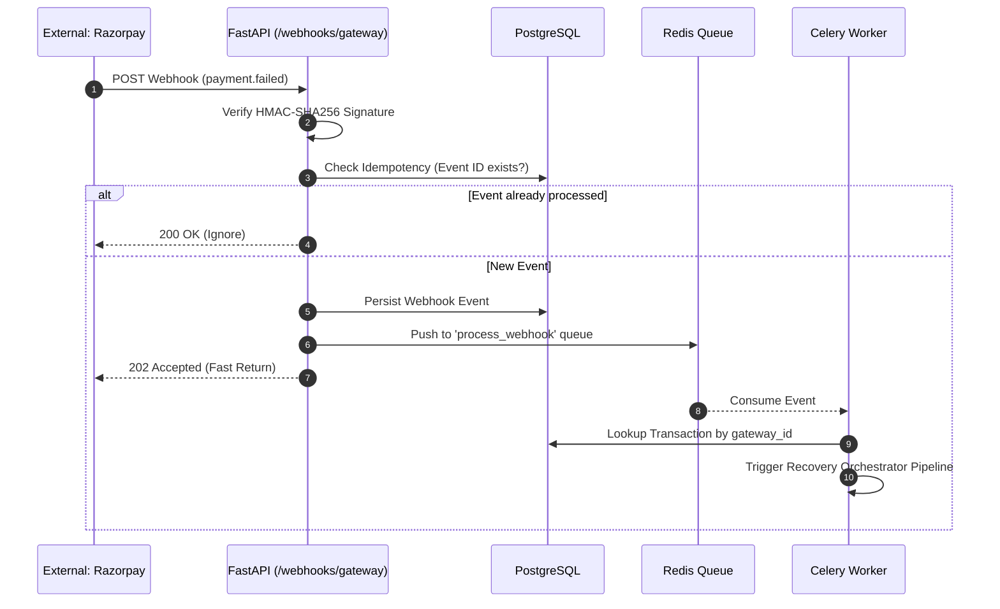
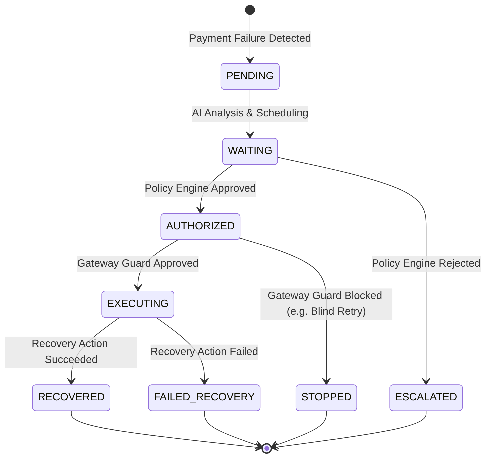
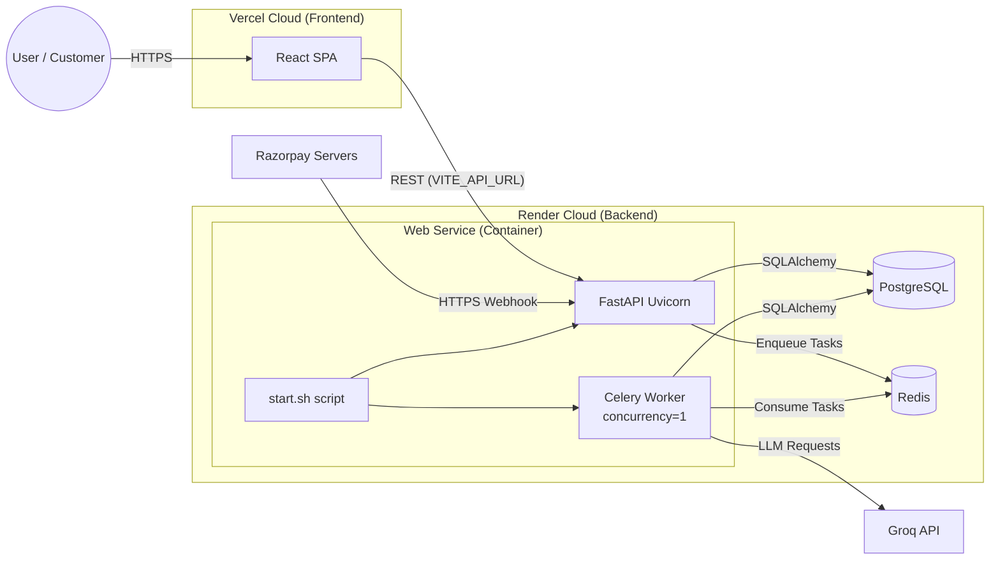
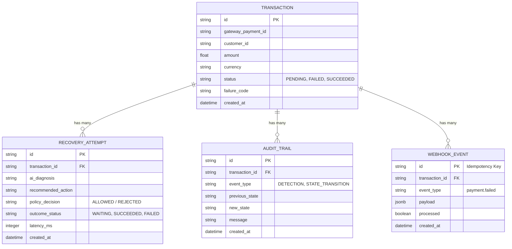

# RecoverAI — Autonomous Revenue Recovery Agent

<div align="center">
  <h3>🚀 <a href="https://recover-ai-xi-ten.vercel.app/" target="_blank"><strong>Live Interactive Demo</strong></a> 🚀</h3>
  <p><strong><a href="https://recover-ai-xi-ten.vercel.app/">https://recover-ai-xi-ten.vercel.app/</a></strong></p>
</div>
<p align="center">
  
</p>

RecoverAI is a financial safety-first autonomous system that recovers failed payments while strictly prohibiting the LLM from executing unauthorized or unsafe financial actions.

<p align="center">
  
</p>

## Problem
Payment failures (e.g., bank timeouts, insufficient funds) result in millions of dollars in lost revenue for merchants. Traditional rule-based retry engines are too rigid, while modern autonomous AI agents are too dangerous to be given direct authority over financial transactions.

## Solution
RecoverAI uses a hybrid pipeline combining machine learning, an LLM reasoning engine, and a deterministic state machine. It evaluates failed payments, infers the root cause, and orchestrates recovery actions without ever granting the LLM direct API access to the payment gateway. 

---

## Key Safety Principle
**The LLM NEVER has direct authority to move money.**
The LLM generates reasoning and a recommended action, but a deterministic Policy Engine evaluates that recommendation against financial safety invariants before any execution is permitted.

---

## Master System Architecture



---

## Detailed Component Analysis

### 1. ML Component (Random Forest)
A machine learning model evaluates historical transaction features to generate a deterministic probability of successful recovery. It is optimized for Expected Value (EV) by balancing the cost of intervention against potential recovered revenue.

### 2. LLM Component (Diagnosis Agent)
The LLM analyzes the failure context, the raw ML probability, and business constraints to reason about the failure mode. It outputs a structured diagnosis and a recommended recovery action (e.g., `RETRY_PAYMENT`, `WAIT_AND_RETRY`, `CREATE_ESCALATION`).

### 3. Deterministic Policy Engine & Safety Guard
A strict rules engine that intercepts the LLM's recommendation. It enforces hard constraints (e.g., max retries, minimum ML probability thresholds, allowed actions per failure code). Finally, the **Execution Guard** ensures the requested action is actually supported by the physical payment gateway before executing it.

### 4. Configurable Payment Gateways (Factory Pattern)
The application dynamically switches between gateway abstractions using the `PAYMENT_PROVIDER` environment variable:
- **MockGateway (`PAYMENT_PROVIDER=mock`)**: A highly robust local simulator that acts like a real gateway. It enforces strict idempotency, simulates network latency, and allows for massive parallel automated testing without requiring real API keys.
- **RazorpayGateway (`PAYMENT_PROVIDER=razorpay`)**: The production-ready integration with Razorpay Test Mode. It safely maps internal semantic actions to strict real-world API endpoints. It fully implements Razorpay webhooks (`payment.failed`, `payment.captured`) using strict HMAC-SHA256 signature verification to achieve true real-time end-to-end integration.

---

## Data Flows and execution Paths

### AI Recovery Decision Pipeline
This diagram highlights the strict safety boundaries preventing the AI from executing unauthorized financial operations.



### Razorpay Webhook Flow
When a real failure occurs in the external world, the webhook payload traverses the security layers before reaching the background workers.



### Transaction State Machine
The system rigorously controls transaction state to ensure asynchronous task failures don't leave transactions in invalid states.



---

## Deployment Architecture

The application is fully cloud-native. The frontend is hosted on Vercel, securely communicating with a Render container hosting both the FastAPI web server and the Celery background worker, backed by Render PostgreSQL and Redis.



---

## Database ER Diagram
The system permanently records all decisions for compliance and auditing.



---

## Project Structure
```text
recoverai/
├── backend/            # FastAPI backend, Orchestrator, Policy Engine
├── frontend/           # React live-visualization UI
├── models/             # Trained ML model and configuration
├── scripts/            # Reproducibility and evaluation scripts
└── README.md           # Documentation
```

## Running Locally

### Environment Variables
Copy `.env.example` to `.env` and fill in the required keys.
```env
# AI Providers
LLM_PROVIDER=mock # options: groq, mock, auto
GROQ_API_KEY=your_groq_key_here

# Payment Providers
PAYMENT_PROVIDER=mock # options: mock, razorpay
RAZORPAY_KEY_ID=your_razorpay_key_here
RAZORPAY_KEY_SECRET=your_razorpay_secret_here
RAZORPAY_WEBHOOK_SECRET=your_webhook_secret_here
```

### Running the Backend (Terminal 1)
```powershell
cd backend
python -m venv .venv
.\.venv\Scripts\activate
pip install -r requirements.txt
uvicorn app.main:app --reload --port 8000
```

### Running the Celery Worker (Terminal 2)
The background worker is required for asynchronous payment recovery execution.
**Windows Users:** You must use `--pool=solo` to avoid a known multiprocessing bug in Celery, and you must explicitly listen to the custom queues.
```powershell
cd backend
.\.venv\Scripts\activate
python -m celery -A app.worker.celery_app worker --loglevel=info --pool=solo -Q celery,high_priority,reconciliation
```

### Running the Frontend (Terminal 3)
```powershell
cd frontend
npm install
npm run dev
```
