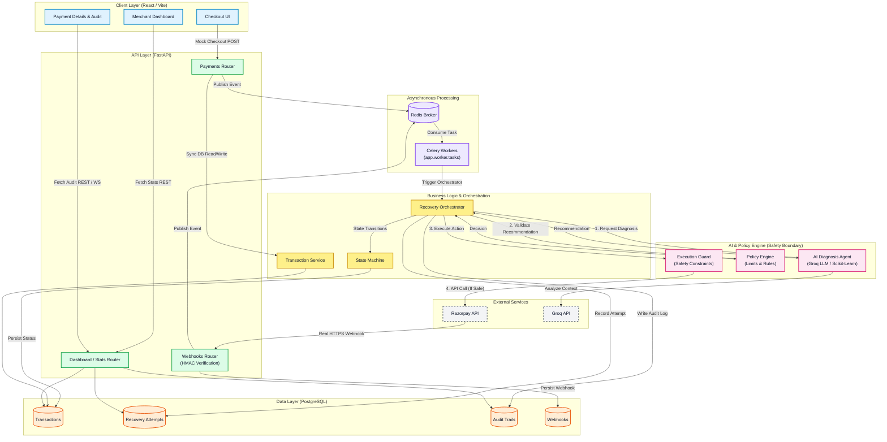
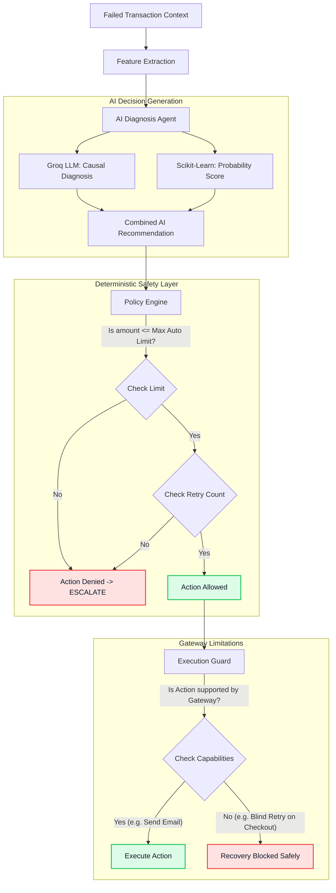
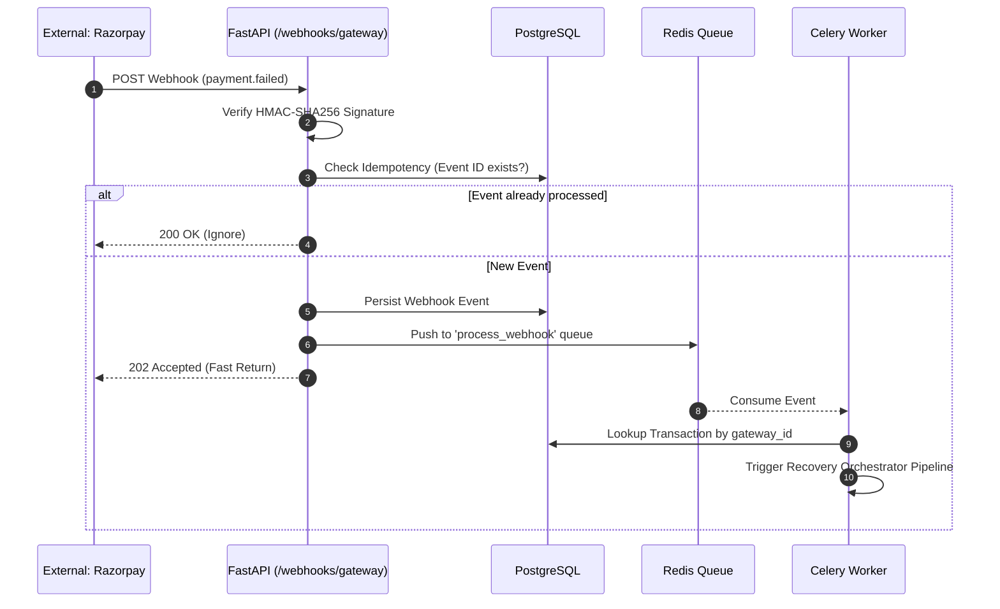
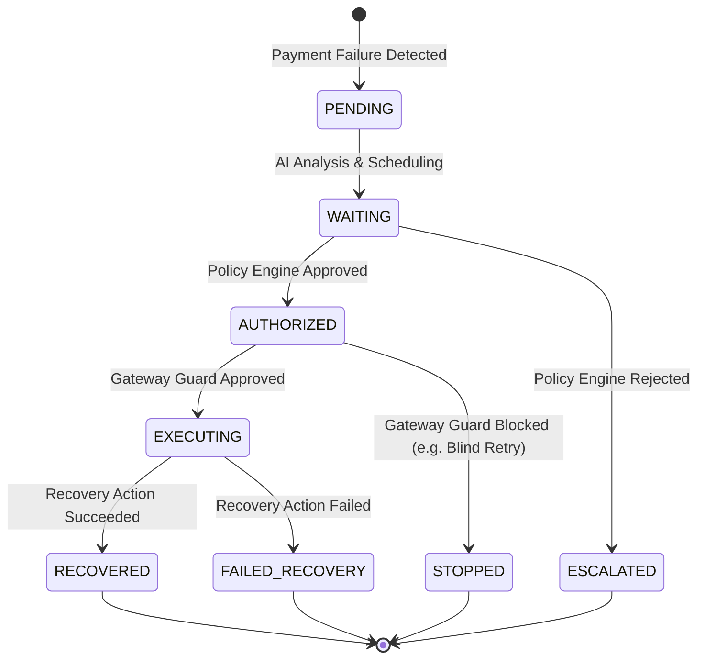
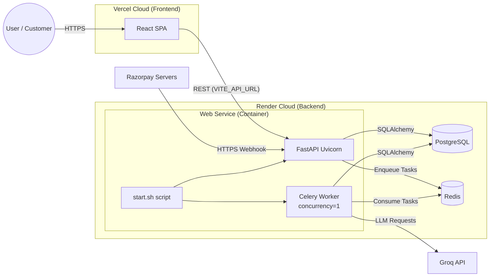
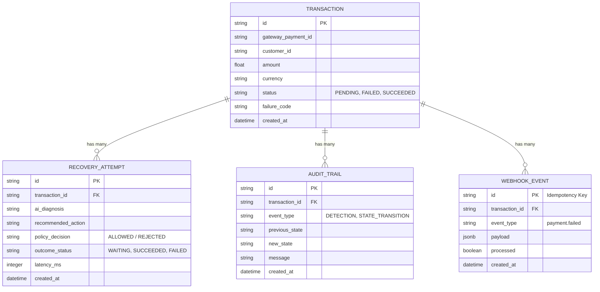

# RecoverAI — Autonomous Revenue Recovery Agent

<div align="center">
  <h3>🚀 <a href="https://recover-ai-xi-ten.vercel.app/" target="_blank"><strong>Live Interactive Demo</strong></a> 🚀</h3>
  <p><strong><a href="https://recover-ai-xi-ten.vercel.app/">https://recover-ai-xi-ten.vercel.app/</a></strong></p>
</div>
<p align="center">
  
</p>

## ✨ Key Features

- 🤖 Hybrid AI diagnosis using Groq LLM + Machine Learning
- 🛡️ Safety-first deterministic Policy Engine
- 🔒 Execution Guard preventing unsupported gateway actions
- ⚡ Asynchronous event-driven processing with Redis + Celery
- 🪝 HMAC-SHA256 verified Razorpay webhooks
- 🔁 Idempotent webhook processing
- 📊 Real-time merchant dashboard
- 📜 Immutable transaction audit trail
- 🔄 Deterministic transaction state machine
- 🧠 Root-cause analysis for payment failures
- ☁️ Fully deployed cloud architecture
- 🧪 Interactive payment failure simulation

RecoverAI is a financial safety-first autonomous system that recovers failed payments while strictly prohibiting the LLM from executing unauthorized or unsafe financial actions.

<p align="center">
  
</p>

## Problem
Payment failures (e.g., bank timeouts, insufficient funds) result in millions of dollars in lost revenue for merchants. Traditional rule-based retry engines are too rigid, while modern autonomous AI agents are too dangerous to be given direct authority over financial transactions.

## Solution
RecoverAI uses a hybrid pipeline combining machine learning, an LLM reasoning engine, and a deterministic state machine. It evaluates failed payments, infers the root cause, and orchestrates recovery actions without ever granting the LLM direct API access to the payment gateway. 

## 🌐 Live Deployment

| Service | URL |
|---|---|
| 🖥️ Frontend Demo | https://recover-ai-xi-ten.vercel.app/ |
| ⚡ Backend API | https://recoverai-api-as5f.onrender.com |
| 📚 API Documentation | https://recoverai-api-as5f.onrender.com/docs |

> The application is deployed using Vercel and Render with PostgreSQL, Redis, FastAPI, and Celery.

---

## 🔐 Security & Safety Guarantees

RecoverAI is designed around the principle that AI reasoning and financial execution must remain separated.

### Safety guarantees

- LLM has no direct payment gateway credentials or execution authority.
- Every AI recommendation passes through deterministic policy validation.
- Execution Guard validates gateway capabilities before execution.
- Razorpay webhooks are verified using HMAC-SHA256 signatures.
- Webhook events are processed idempotently.
- Transaction state transitions are explicitly controlled.
- Every recovery decision is recorded in an audit trail.
- Unsupported financial actions are blocked safely.

## ⚠️ Gateway Safety & Real-World Constraints

RecoverAI intentionally does not blindly retry failed Razorpay payments.

During testing, the AI may determine that a transaction is eligible for a `WAIT_AND_RETRY` recovery strategy. However, the Execution Guard performs a final capability check against the payment gateway.

If Razorpay does not support safely retrying the original transaction, RecoverAI blocks the execution:

```text
AI Recommendation
       ↓
Policy Approved
       ↓
Execution Guard
       ↓
Gateway Capability Check
       ↓
❌ Unsupported Action
       ↓
Recovery Blocked Safely
```

This behavior is intentional.

Rather than allowing an AI agent to perform an unsafe or unsupported financial operation, RecoverAI fails safely and records the reason in the audit trail.

A safely blocked recovery is preferable to an unauthorized financial action.

---

## 🔄 What Happens When a Payment Fails?

RecoverAI follows a safety-first autonomous recovery pipeline:

```text
1. Payment Failure Detected
        ↓
2. Transaction Event Created
        ↓
3. Event Sent to Redis Queue
        ↓
4. Celery Worker Processes Failure
        ↓
5. AI Diagnoses Root Cause
        ↓
6. ML Model Estimates Recovery Probability
        ↓
7. LLM Recommends Recovery Action
        ↓
8. Deterministic Policy Engine Validates Action
        ↓
9. Execution Guard Checks Gateway Capability
        ↓
10. Safe Action Executed OR Recovery Blocked
        ↓
11. Complete Decision Stored in Audit Trail
```

### Example

A transaction fails because of a temporary bank timeout.

1. The AI diagnoses the failure as potentially transient.
2. The ML model estimates the probability of successful recovery.
3. The AI may recommend `WAIT_AND_RETRY`.
4. The Policy Engine checks retry limits and financial constraints.
5. The Execution Guard checks whether Razorpay actually supports that retry.
6. If unsupported, RecoverAI safely blocks the action instead of blindly retrying the payment.

This is a key design principle of RecoverAI:

**Autonomy does not mean unrestricted execution.**

---

## Master System Architecture



---

## Detailed Component Analysis

### 1. Redis (Message Broker & Queue) ⚡
Acts as the intermediary "waiting room" between the FastAPI web server and background workers. When a webhook arrives from Razorpay, FastAPI instantly pushes the payload to Redis and returns a `202 Accepted` to Razorpay. This prevents the payment gateway from timing out, even if the AI takes several seconds to generate a response. 

### 2. Celery (Distributed Task Worker) ⚙️
Consumes tasks from the Redis queue and orchestrates the heavy lifting in the background without blocking the main web server. Celery is responsible for querying the database, calling the Groq LLM API, executing the Policy Engine, and managing the Transaction State Machine.

### 3. PostgreSQL (Permanent Datastore) 🗄️
The highly relational database acting as the permanent memory of the system. It strictly enforces foreign key constraints and schemas (managed by SQLAlchemy/Alembic) to store `Transactions`, `RecoveryAttempts`, `Webhooks`, and immutable `AuditTrails`. 

### 4. FastAPI (API Web Server) 🧠
The lightning-fast core Python API that handles real-time HTTP requests, verifies cryptographically signed Razorpay Webhooks (HMAC-SHA256), and serves analytical data back to the React frontend.

### 5. Groq API (LLM Engine) 🤖
Provides ultra-fast Llama 3 inference. It acts as the semantic reasoning engine to analyze the failure context and recommend a recovery action (e.g., `WAIT_AND_RETRY`), without ever being granted direct permission to execute that action.

### 6. React & Vite (Frontend Dashboard) 🖥️
A responsive Single Page Application (SPA) providing a merchant control center. It visualizes the current state of the database, simulates checkout failures for testing, and streams live audit logs of the AI's decision-making process.

### 7. Deterministic Policy Engine & Safety Guard 🛡️
A strict Python rules engine that intercepts the LLM's recommendation. It enforces hard constraints (e.g., max retries). Finally, the **Execution Guard** ensures the requested action is actually supported by the physical payment gateway before executing it.

---

## 🛠️ Tech Stack

<div align="center">

### Frontend & UI


### Backend & AI


### Data & Infrastructure


### Deployment


</div>

---

## Data Flows and execution Paths

### AI Recovery Decision Pipeline
This diagram highlights the strict safety boundaries preventing the AI from executing unauthorized financial operations.



### Razorpay Webhook Flow
When a real failure occurs in the external world, the webhook payload traverses the security layers before reaching the background workers.



### Transaction State Machine
The system rigorously controls transaction state to ensure asynchronous task failures don't leave transactions in invalid states.



---

## Deployment Architecture

The application is fully cloud-native. The frontend is hosted on Vercel, securely communicating with a Render container hosting both the FastAPI web server and the Celery background worker, backed by Render PostgreSQL and Redis.



---

## Database ER Diagram
The system permanently records all decisions for compliance and auditing.



---

## Project Structure
```text
recoverai/
├── backend/                             # Python Backend Workspace
│   ├── alembic/                         # Database Migration Scripts
│   ├── app/
│   │   ├── api/v1/                      # FastAPI Routers (Payments, Webhooks, Dashboard)
│   │   ├── core/                        # Core config, Database setup, State Machine
│   │   ├── models/                      # SQLAlchemy Database Models (Tables)
│   │   ├── schemas/                     # Pydantic Validation Schemas
│   │   ├── services/                    
│   │   │   ├── orchestration/           # The Recovery Orchestrator Pipeline
│   │   │   ├── agents/                  # AI Diagnosis Agent (Groq / ML Integration)
│   │   │   └── gateways/                # Razorpay and Mock Payment Adapters
│   │   ├── worker/                      # Celery App and Async Background Tasks
│   │   └── main.py                      # FastAPI Application Entrypoint
│   └── tests/                           # Pytest Test Suite
│
├── frontend/                            # React & Vite Frontend Workspace
│   ├── src/
│   │   ├── components/                  # Reusable UI (Buttons, Status Badges)
│   │   ├── context/                     # React Context (Payment Flow & Live Logs)
│   │   ├── pages/                       # App Views (Dashboard, Checkout, Details)
│   │   ├── services/                    # API client and WebSocket integration
│   │   └── index.css                    # Global Styles (Tailwind/Custom CSS)
│   ├── vercel.json                      # Vercel SPA Routing Configuration
│   └── package.json                     # NPM Dependencies
│
├── models/                              # Trained Machine Learning Assets
│   └── recovery_model_v2.pkl            # Pickled Random Forest Model
│
├── scripts/                             # Reproducibility & Build Scripts
│   └── reproduce_v2.ps1                 # Automated E2E Setup Script
│
├── assets/                              # Repository Images (Cover, Architecture)
├── system_architecture.md               # Extensive System Architecture Documentation
└── README.md                            # Main Project Documentation
```

## 🔌 Core API Endpoints

| Method | Endpoint | Description |
|---|---|---|
| `POST` | `/api/v1/payments/...` | Create / simulate payment transaction |
| `POST` | `/api/v1/webhooks/gateway` | Receive payment gateway webhooks |
| `GET` | `/api/v1/transactions` | Retrieve transactions |
| `GET` | `/api/v1/dashboard/metrics` | Dashboard analytics |
| `GET` | `/api/v1/audit/{transaction_id}` | Retrieve transaction audit trail |
| `GET` | `/docs` | Interactive Swagger API documentation |

---

## Running Locally

### Environment Variables
Copy `.env.example` to `.env` and fill in the required keys.
```env
# AI Providers
LLM_PROVIDER=mock # options: groq, mock, auto
GROQ_API_KEY=your_groq_key_here

# Payment Providers
PAYMENT_PROVIDER=mock # options: mock, razorpay
RAZORPAY_KEY_ID=your_razorpay_key_here
RAZORPAY_KEY_SECRET=your_razorpay_secret_here
RAZORPAY_WEBHOOK_SECRET=your_webhook_secret_here
```

### Running the Backend (Terminal 1)
```powershell
cd backend
python -m venv .venv
.\.venv\Scripts\activate
pip install -r requirements.txt
uvicorn app.main:app --reload --port 8000
```

### Running the Celery Worker (Terminal 2)
The background worker is required for asynchronous payment recovery execution.
**Windows Users:** You must use `--pool=solo` to avoid a known multiprocessing bug in Celery, and you must explicitly listen to the custom queues.
```powershell
cd backend
.\.venv\Scripts\activate
python -m celery -A app.worker.celery_app worker --loglevel=info --pool=solo -Q celery,high_priority,reconciliation
```

### Running the Frontend (Terminal 3)
```powershell
cd frontend
npm install
npm run dev
```

---

## 🚀 Future Improvements

- Support additional payment gateways such as Stripe.
- Implement customer-safe retry flows using payment links.
- Add human-in-the-loop approval for high-value transactions.
- Introduce adaptive recovery policies using historical outcomes.
- Add anomaly detection for unusual failure patterns.
- Implement merchant-configurable financial risk limits.
- Support multi-currency recovery strategies.
- Add production-grade monitoring and observability dashboards.

---

## 💡 Project Philosophy

RecoverAI explores a critical question in financial AI:

> **How can we benefit from autonomous AI reasoning without giving an AI system unrestricted authority over money?**

The answer implemented in RecoverAI is **constrained autonomy**.

The AI can:

- Analyze
- Reason
- Diagnose
- Recommend

But deterministic software controls whether an action is actually allowed and technically possible.

```text
AI Intelligence
      ↓
Policy Constraints
      ↓
Execution Guard
      ↓
Safe Financial Action
```

RecoverAI demonstrates that in high-stakes systems, the goal should not be to maximize AI autonomy.
