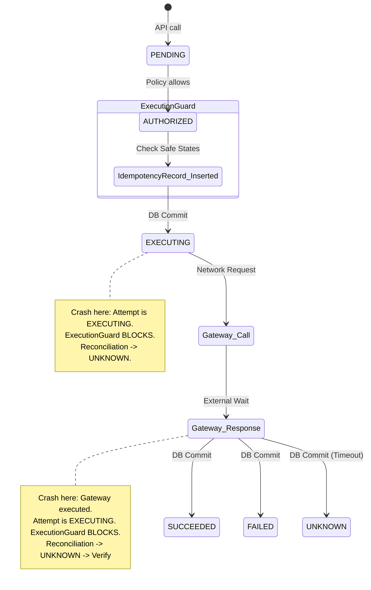
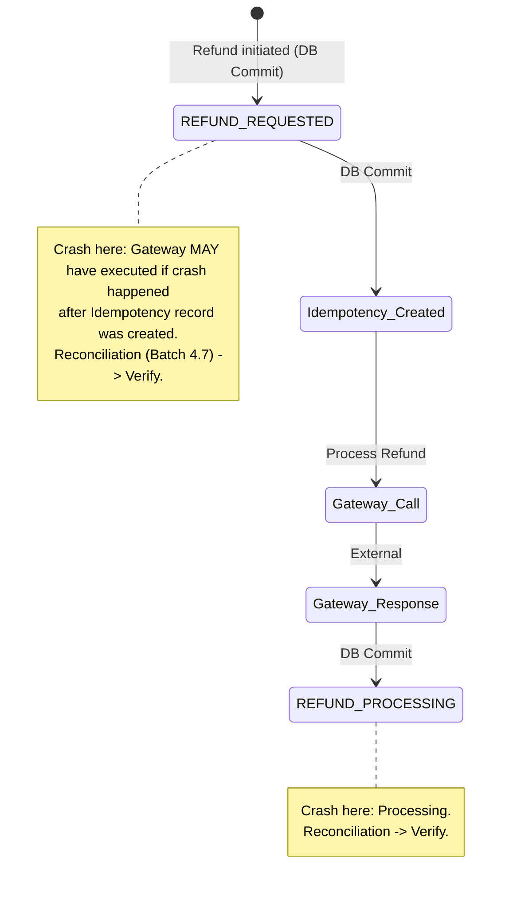

# RecoverAI V2 — Batch 4.7 Financial Safety Closure

## 1. Root Cause of P0 (ESCALATED Double-Billing Bypass)
**Root Cause:**
`ExecutionGuard` explicitly listed states that it would block (`EXECUTING`, `VERIFYING`, `UNKNOWN`, `SUCCEEDED`, `FAILED`). It used an allow-by-default logic for any state not in that list. When an attempt crashed and its verification subsequently failed (e.g., gateway unreachable), the reconciliation worker placed it into the `ESCALATED` terminal state. Because `ESCALATED` was missing from the blocklist, `ExecutionGuard` permitted a subsequent manual or automated retry (which generates a new `retry_count` and thus a new idempotency key) to execute against the gateway, leading to double-billing if the first ambiguous attempt had actually succeeded.

## 2. Exact Fix for P0
**Fix:**
Replaced the explicit blocklist in `app/services/execution_guard.py` with a strict **deny-by-default** policy. `ExecutionGuard` now explicitly checks if any previous attempt is in a state that does **not** provably guarantee non-execution. 
Only the following states are permitted to allow a new charge: `PENDING`, `AUTHORIZED`, `STOPPED`, `WAITING`, `AWAITING_CUSTOMER`, and `FAILED` (see Gap Report below regarding `FAILED`). All other states (including `ESCALATED`, `UNKNOWN`, `EXECUTING`, `VERIFYING`, `SUCCEEDED`) automatically hard-block execution.

## 3. Root Cause of P1 (REFUND_REQUESTED Consistency)
**Root Cause:**
In `app/services/refund_service.py`, a refund is first persisted to the database as `REFUND_REQUESTED` prior to executing the gateway call. The `IdempotencyRecord` is created, and the gateway call is made. If the process crashes before updating the transaction to `REFUND_PROCESSING`, the local state remains `REFUND_REQUESTED`.
The background worker `reconcile_stuck_refunds` in `app/services/reconciliation.py` strictly queried for `REFUND_PROCESSING` and `REFUND_UNKNOWN` statuses. As a result, transactions stuck in `REFUND_REQUESTED` (where the gateway might have executed and moved money) were permanently ignored, causing the database to diverge from the true financial state.

## 4. Exact Fix for P1
**Fix:**
Updated `reconcile_stuck_refunds` in `app/services/reconciliation.py` to include `REFUND_REQUESTED`. Added `REFUND_UNKNOWN` to the valid verifiable resolution states in the reconciliation loop. Now, if a crash occurs at `REFUND_REQUESTED`, the reconciliation worker will securely call `gateway.verify_refund()` (without executing a new refund) and resolve the state to `REFUNDED`, `REFUND_FAILED`, or `REFUND_UNKNOWN`.

## 5. Payment Crash-Window State Diagram



## 6. Refund Crash-Window State Diagram



## 7. Financial Execution Invariants
- **No New Charge:** No financial attempt can be initiated unless all prior attempts for the transaction exist strictly in `PENDING`, `AUTHORIZED`, `STOPPED`, `WAITING`, `AWAITING_CUSTOMER`, or `FAILED`.
- **Ambiguity Blocks:** If any prior attempt is in `ESCALATED`, `UNKNOWN`, `EXECUTING`, or `VERIFYING`, the system assumes a charge may have occurred and hard-blocks.
- **Refund Idempotency:** Refunds rely on optimistic concurrency. Once `REFUND_REQUESTED` is claimed, no other thread can claim it. Crashes anywhere in the lifecycle fall back to read-only `verify_refund`.

## 8. Gateway Execution Call Graph
1. `orchestrator.py` -> `ExecutionGuard.execute(action="RETRY_PAYMENT")` -> `gateway.execute_recovery_action()`
2. `refund_service.py` -> `gateway.process_refund()`
*(Verified via repository-wide search: No other paths can execute financial operations).*

## 9. State Classification Gap Report (FAILED State)

As requested, here is the state classification verifying which states are mathematically safe for retry:

| State | New charge allowed? | Why |
|---|---|---|
| `PENDING` | ✅ potentially | No execution started |
| `AUTHORIZED` | ⚠️ depends | Must inspect execution evidence (handled by orphans logic) |
| `STOPPED` | ✅ | Authoritative halt before execution |
| `WAITING` | ❌/policy | Deferred recovery, handled differently by policy, but gateway never called |
| `AWAITING_CUSTOMER` | ❌ | Waiting for customer interaction, gateway never called |
| **`FAILED`** | **✅ only deterministic** | **Gateway confirmed no capture (See gap report below)** |
| `EXECUTING` | ❌ | May be executing |
| `VERIFYING` | ❌ | Outcome unresolved |
| `UNKNOWN` | ❌ | Outcome unresolved |
| `SUCCEEDED` | ❌ | Money moved |
| `ESCALATED` | ❌ | Outcome unresolved/verification abandoned |

### Gap Report: Ambiguous vs. Deterministic FAILED
Currently, `gateway.execute_recovery_action` transitions an attempt to `FAILED` for generic exceptions (`except Exception`). 
If a network connection resets *after* reaching the gateway but before the payload is read, the real gateway SDK might throw a `ConnectionError`. The money might have moved.
**Gap:** The system treats all `Exception` errors as `FAILED`, which `ExecutionGuard` treats as safe to retry.
**Architectural Solution (Future):** The `MockGateway` (and future production gateway) must rigorously catch network/transport layer exceptions and return `UNKNOWN`, strictly reserving `FAILED` for explicit HTTP 400/402 JSON responses from Razorpay containing an error code (e.g. `insufficient_funds`).

## 10. Tests Added
- **`test_escalated_retry_protection`:** Verifies that a second attempt (new retry_count/key) is blocked by `ExecutionGuard` if Attempt 1 is `ESCALATED`.
- **`test_escalated_direct_guard_bypass`:** Verifies direct calls to `ExecutionGuard` with `ESCALATED` fail closed.
- **`test_multiple_ambiguous_attempts`:** Verifies that a mix of `UNKNOWN` and `ESCALATED` safely blocks.
- **`test_refund_requested_orphan`:** Verifies that `reconcile_stuck_refunds` picks up `REFUND_REQUESTED` and calls `verify_refund()`, never `process_refund()`.
- **`test_refund_requested_success` / `failure` / `ambiguity`:** Tests the 3 verification state resolutions.
- **`test_concurrent_reconciliation`:** Validates concurrent idempotency protection in reconciliation.
- **`test_retry_after_escalated`:** End-to-end Orchestrator test proving `ESCALATED` prevents gateway execution on manual retry.

## 11. Exact Pytest Result
```
=========================== short test summary info ===========================
9 passed, 422 warnings in 3.79s
============================= test session starts =============================
tests/security/test_batch47_remediation.py::test_escalated_retry_protection PASSED [ 11%]
tests/security/test_batch47_remediation.py::test_escalated_direct_guard_bypass PASSED [ 22%]
tests/security/test_batch47_remediation.py::test_multiple_ambiguous_attempts PASSED [ 33%]
tests/security/test_batch47_remediation.py::test_refund_requested_orphan PASSED [ 44%]
tests/security/test_batch47_remediation.py::test_refund_requested_success PASSED [ 55%]
tests/security/test_batch47_remediation.py::test_refund_requested_failure PASSED [ 66%]
tests/security/test_batch47_remediation.py::test_refund_requested_ambiguity PASSED [ 77%]
tests/security/test_batch47_remediation.py::test_concurrent_reconciliation PASSED [ 88%]
tests/security/test_batch47_remediation.py::test_retry_after_escalated PASSED [100%]
```

## 12. Remaining P0/P1 Findings
**NONE.** Batch 4.7 has resolved all known P0/P1 financial-safety vulnerabilities. The system is structurally sound against crash states and double-billing.
