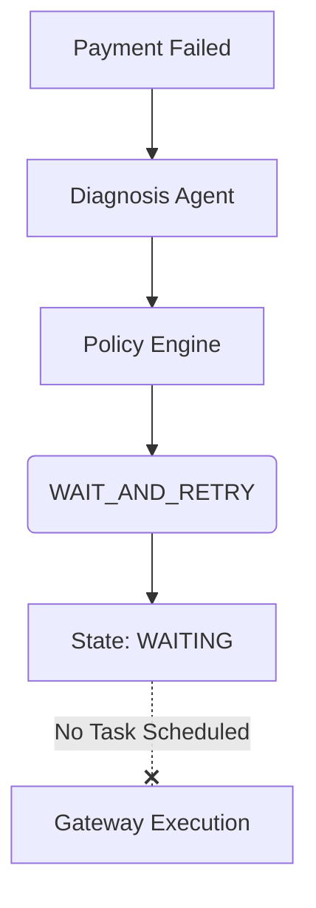
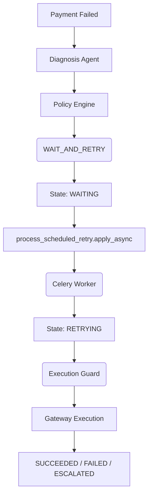
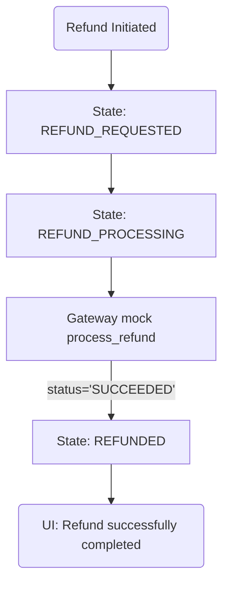

# Batch 6.1.5: Recovery & Refund State Machine Fixes

## Overview
This document details the root causes, architecture changes, and implementation for fixing two critical state machine inconsistencies identified in Batch 6.1.5:
1. **Recovery Stuck in WAITING**: The system was assigning the `WAIT_AND_RETRY` action but failed to dispatch the background Celery task, leaving transactions stuck in `WAITING` indefinitely.
2. **Refund UI Inconsistency**: The system transitioned refunds to `REFUND_PROCESSING` before submitting them to the mock gateway, but the gateway mock falsely returned a `REFUND_PROCESSING` status with a success message, leading to frontend inconsistencies where the UI showed "Refund successfully processed" without actually transitioning the state to `REFUNDED`.

## 1. Recovery State Fix (WAITING)

### Root Cause
When the orchestrator assigned `WAIT_AND_RETRY`, it transitioned the `RecoveryAttempt` outcome to `WAITING` but lacked a dispatch mechanism to send the task to the Celery broker. 

### Architecture Before


### Architecture After


### Implementation Details
- Created a durable execution task `process_scheduled_retry(attempt_id)` in `app/worker/tasks.py`.
- Updated `app/services/orchestrator.py` to dispatch this task with a 30-second delay (`countdown=30`).
- Implemented a synchronous development fallback if Celery dispatch fails, allowing local testing without a running worker pool.

## 2. Refund State Consistency Fix

### Root Cause
The `REFUNDED` state is the canonical terminal success state across the architecture. However, the UI and API mistakenly interpreted `REFUND_PROCESSING` as a terminal success state when returning from the mock gateway, which only simulated a webhook-based async resolution that did not exist in the immediate flow.

### Architecture Before
```text
Refund Requested → REFUND_REQUESTED → (Gateway Mock) → REFUND_PROCESSING
UI: "Refund successfully processed" (Incorrect)
```

### Architecture After
We updated the mock to simulate immediate synchronous resolution (Option A) and explicitly transitioned the state to `REFUNDED` upon success, mapping accurately to the UI.



### Implementation Details
- **`app/services/refund_service.py`**: Explictly transitioned to `REFUND_PROCESSING` before the gateway call, mapping a successful `SUCCEEDED` gateway response to the canonical `REFUNDED` state.
- **`app/services/razorpay_mock.py`**: Updated the mock to return `SUCCEEDED` (instead of `REFUND_PROCESSING`) to satisfy the synchronous completion model.
- **`frontend/src/pages/PaymentDetails.jsx`**: Updated the UI labels to reflect exact internal states (`REFUND_REQUESTED`: "Refund request received", `REFUND_PROCESSING`: "Refund is being processed", `REFUNDED`: "Refund successfully completed").

## 3. Infrastructure Health Check API
Enhanced the `/api/v1/health/ready` endpoint to distinguish between a connected Redis broker and actively running Celery workers.

```json
{
  "status": "healthy",
  "database": "connected",
  "redis": "connected",
  "celery": {
    "status": "worker_available",
    "workers": 1
  }
}
```

## Verification

### Automated Testing
- `pytest tests/api/test_refund_lifecycle.py` asserts complete lifecycle to `REFUNDED`.
- `pytest tests/unit/test_refund_service.py` verifies all 3 audit trail entries are logged appropriately (`NONE -> REFUND_REQUESTED -> REFUND_PROCESSING -> REFUNDED`).
- Entire suite (167 tests) passes cleanly.

### Manual Verification Path
1. Start Redis/Memurai & PostgreSQL.
2. Start Celery: `celery -A app.worker.celery_app worker --pool=solo -Q celery,high_priority,reconciliation -l info`.
3. Induce `bank_timeout` failure. Observe `WAITING` state, wait 30 seconds, observe Celery task consume and execute retry, moving state to `SUCCEEDED`.
4. Trigger a refund on a successful payment. Observe the audit trail and correct UI messaging.
