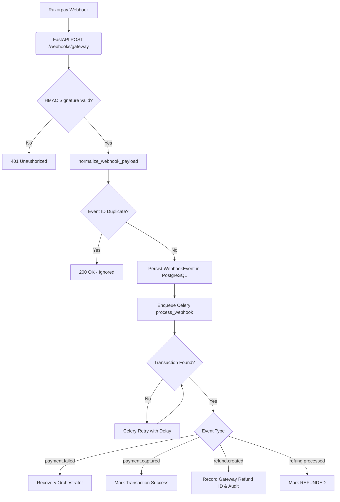

# Batch 6.1.6-C — Real Razorpay Webhook Integration

This document outlines the architecture, data flows, and safety mechanisms implemented to process real Razorpay Test Mode webhooks while preserving RecoverAI's mock-based testing baseline.

## 1. Core Architecture

The ingestion pipeline handles raw payloads safely, extracts nested fields securely, and relies on Celery for durable transaction matching and business logic.



## 2. Event Mapping

| Razorpay Event Name | RecoverAI Action | Transaction Field Affected |
| :--- | :--- | :--- |
| `payment.failed` | Trigger `RecoveryOrchestrator` if eligible | `recovery_status` |
| `payment.captured` | Update transaction payment state to success | `status` |
| `refund.created` | Persist `gateway_refund_id` and audit trail | `gateway_refund_id` |
| `refund.processed` | Transition refund state to `REFUNDED` | `refund_status` |
| Mock `refund.completed` | Preserve compatibility (maps to `REFUNDED`) | `refund_status` |

## 3. Signature Verification

All webhook payloads are verified **before** they are parsed as JSON. The system securely reads the raw request bytes and uses the `RazorpayGateway` to compare the `X-Razorpay-Signature` against our configured `WEBHOOK_SECRET`. Invalid signatures return an immediate HTTP 401.

## 4. Normalization & Mock Compatibility

A dedicated `webhook_parser.py` module ensures that both real nested Razorpay payloads and flat Mock payloads are normalized into a single predictable dictionary containing:
- `event_id` (Extracted from `X-Razorpay-Event-Id` header)
- `event_type`
- `gateway_payment_id`
- `gateway_refund_id`

This isolates the provider-specific payload complexity from the core API and the Celery workers.

## 5. Idempotency Design

- Razorpay guarantees at-least-once delivery, which can result in duplicates.
- The canonical `event_id` is persisted as a unique column in the `WebhookEvent` table.
- A duplicate event causes an `IntegrityError` upon insertion. We gracefully catch this error and return HTTP 200 to Razorpay without enqueueing a duplicate Celery task.

## 6. Transaction Matching & Retry Strategy

- **Lookup:** Transactions are resolved using the `gateway_payment_id`.
- **Missing Transactions (Race Condition):** If a `payment.failed` webhook arrives before the frontend's REST API call has persisted the internal Transaction, the Celery task will deliberately fail and raise `self.retry(countdown=60, max_retries=5)`.
- This deterministic Celery native retry mechanism ensures the webhook pauses and tries again later, at which point the frontend will have likely created the database record.

## 7. Out-of-Order Event Handling & Locking

State mutation inside `process_webhook` relies on row-level database locking:
```python
txn = db.query(Transaction).filter(...).with_for_update().first()
```
This protects against concurrent execution. For example, if two `payment.failed` webhooks are processed simultaneously, the lock guarantees that `txn.recovery_status == "NOT_STARTED"` evaluates true for only one worker, thus preventing duplicate recovery orchestrations from being queued.

## 8. Test Results

The integration was validated rigorously:
1. `tests/unit/test_webhook_parser.py`: Verified nested payload parsing.
2. `tests/api/test_webhooks.py`: Validated 401 signature rejections and idempotency behavior.
3. `tests/integration/test_celery_worker.py`: Validated Celery native retries on missing transactions and state machine preservation.
4. **Full Test Baseline:** Over 176 backend tests passed successfully with `$env:PAYMENT_PROVIDER="mock"` after implementing the updates.
